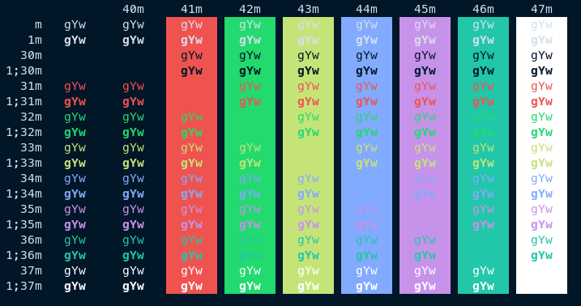
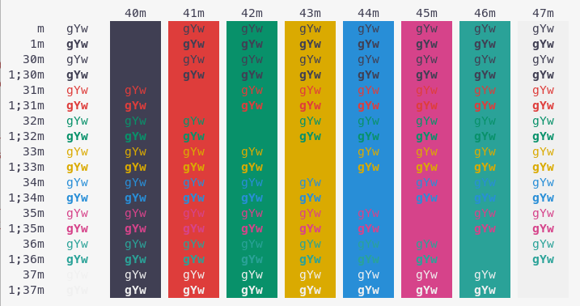

# Night Owl for Alacritty

## **A port of Sarah Drasner’s [Night Owl VS Code theme](https://github.com/sdras/night-owl-vscode-theme) for Alacritty.**

This repository includes both **Night Owl** and **Light Owl** themes.

Night Owl theme



Light Owl Theme



## Installation
Copy the contents of [night-owl.yml](https://github.com/nik27/night-owl-alacritty-theme/blob/main/night-owl.yml) into your config file located at `~/.config/alacritty/alacritty.yml` and then set colors:
```yml
# Night Owl (dark theme)
colors: *night-owl

# Light Owl (light theme)
colors: *night-owl-light
```